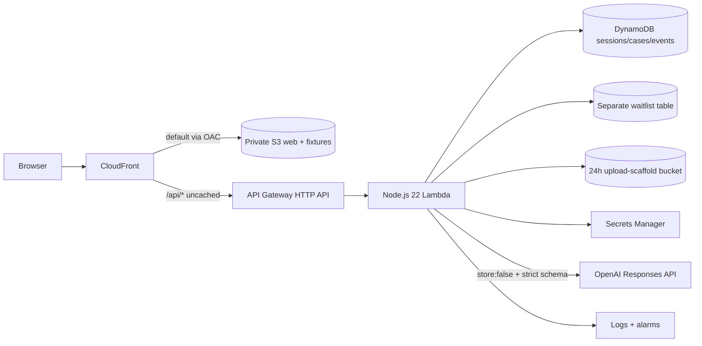

# Redo Return Integrity

An evidence-led return decision prototype that gives good shoppers a path through uncertainty, gives merchants an accountable review, and gives warehouse operators a reproducible way to capture physical ground truth.

This is an independent Senior Software Engineer candidate proposal by Canyon Smith—not an official Redo product or roadmap. The fictional merchant is **Juniper Circuit**. Commerce, payment, carrier, identity, WMS, and Reclaim data are synthetic. AWS persistence and OpenAI assessment are live only when the deployed UI says so.

[Open the live AWS prototype](https://d1s8s6dxodk0qc.cloudfront.net) · [View the public source repository](https://github.com/grandcanyonsmith/redo-return-integrity)

## The first problem

The first deep fraud/abuse family is:

- empty return;
- decoy or wrong item;
- quantity mismatch;
- possible imitation requiring qualified review;
- inconclusive evidence requiring more information.

OpenAI may extract and compare evidence, surface contradictions and exculpatory facts, abstain, and recommend a bounded next step. It cannot make a final denial, determine criminal intent, declare a person fraudulent, submit a payment dispute, or declare an item counterfeit from a photograph.

## What the prototype demonstrates

### Three end-to-end journeys

1. **Good actor at checkout:** targeted bot/payment/verified-channel/identity-vendor simulation with accessible alternatives. Completion can clear the order; decline, abandonment, and technical failure remain separate and never become fraud labels.
2. **Impossible reverse logistics:** deterministic distance/time and scan-order checks, followed by a synthetic staffed receipt, carrier trace, or human review. New evidence supersedes rather than deletes the prior decision.
3. **Managed physical return:** calibrated weight, exterior/opening/content images, quantity/SKU/serial comparisons, structured OpenAI image assessment, merchant policy, human decision, shopper contest, and evidence-ready Reclaim boundary.

### The shared decision contract

Every one of the 15 lifecycle checkpoints exposes:

```text
native facts
  → deterministic signals
  → OpenAI assessment (structured, bounded, may abstain)
  → versioned merchant policy
  → accountable final action
  → shopper cure / appeal
  → next state
```

Evidence is filtered by `availableAt` and lifecycle position, so later warehouse outcomes cannot leak into an earlier checkout evaluation. Model, prompt, schema, policy, protocol, provenance, and simulated/live state remain visible.

## Fifteen checkpoints

| Purchase | Fulfillment | Return | Resolution |
|---|---|---|---|
| Visit & session | Outbound pack | Return request | Warehouse receipt |
| Identity link | Outbound custody | Return authorization | Item inspection |
| Checkout & payment | Delivery & possession | Reverse handoff | Refund settlement |
| Order release |  | Reverse transit | Contest, appeal & recovery |

The [lifecycle matrix](docs/lifecycle-decision-matrix.md) lists the data sources and data points available at each checkpoint, decision options, escalation triggers, and every shopper cure path.

## Product layers

| Layer | Role |
|---|---|
| Evidence & Observe (free/bundled) | standardize facts/photos/weights, draft explanations, build evidence-ready packets, run shadow evaluations, save review labor |
| Predict & Decide (Pro) | calibrated recommendations, merchant policy, proportionate challenges, experiments, and broad-surface analytics |
| Managed Verify | Redo-operated receipt/inspection protocol and highest-quality physical evidence |
| Protection (separate) | contractual risk transfer and payout accounting—not model prevention |

Evidence & Observe is the wedge: it can create operational value and better labels before predictive efficacy has been proven.

## Measurement that does not manufacture savings

The evaluation lab separates:

- verified policy-ineligible value stopped;
- randomized intention-to-treat estimated loss avoided;
- unresolved exposure/amount held;
- actual recovered cash;
- protection payout/risk transfer;
- labor savings;
- legitimate shopper friction and margin loss.

A non-verifier is not counted as fraudulent. The same dollars cannot be counted at every lifecycle stage or added across prevention, recovery, and protection.

The `$80M` managed-warehouse and `$200M` broader-surface values are supplied planning scenarios, not verified Redo revenue. They remain separate until Redo finance defines their grain, period, and relationship. Even if both are comparable merchant GMV and `$80M` is a true subset, that ratio is only physical-protocol surface coverage—not a fraud or prevention rate. See the [measurement method and worked examples](docs/measurement-methodology.md).

## Architecture



- TypeScript strict-mode domain package shared by React and Lambda.
- React 19 + Vite + React Router + TanStack Query.
- Zod runtime contracts and decision invariants.
- Deterministic rules execute before model assessment.
- GPT-5.6 Terra is the proposed default; the key is fetched server-side from a secret named `OPENAI_API_KEY`.
- CloudFront OAC keeps the web bucket private; `/api/*` is same-origin and uncached.
- Anonymous fixture sessions expire after 24 hours; opted-in waitlist records use a separate table with a 30-day active-retention target. AWS TTL deletion and retained backups may lag per policy.
- Public model budgets: 30 evaluations/session and 250/day.
- API/model/schema failure routes to human review, never denial.

The presigned upload route is intentionally a **scaffold**. It limits declared media to JPEG/PNG/WebP up to 5 MB and targets 24-hour retention, but an object remains “not evidence” until a future finalize-time magic-byte/checksum check exists. Demonstrated image decisions use curated synthetic fixtures.

Read the [architecture](docs/architecture.md), [data dictionary](docs/data-dictionary.md), [API contract](docs/api.md), and [security/privacy model](docs/security-privacy.md) for details.

## Repository layout

```text
apps/web/        React experience for landing, lifecycle, shopper, merchant,
                 operator, evaluation lab, and reset
packages/domain/ checkpoints, evidence filters, deterministic rules, policy,
                 metrics, schemas, and synthetic fixtures
services/api/    Lambda router, DynamoDB/memory stores, OpenAI Responses API,
                 Secrets Manager, and upload scaffold
infra/           TypeScript CDK, CloudFormation synth, web publisher, alarms
docs/            product, lifecycle, math, architecture, deployment, and handoff
.github/         verification CI only; no automatic deployment or cloud secret
```

## Run locally

Requirements: Node.js 22 and npm 10+.

```bash
npm ci
npm run dev
```

The local Vite experience works with visible synthetic/fallback decisions when no API is served. It never silently claims that fallback is a live model result.

## Verify

```bash
npm run typecheck
npm test
npm run build
npm run synth
npm run test:e2e
```

Or run the contract/build/synth bundle:

```bash
npm run verify
```

Tests cover point-in-time evidence leakage, decision invariants, noncompletion-not-fraud, deterministic logistics/physical signals, metric double-count prevention, OpenAI schema/evidence-reference/error behavior, session/store limits, React rendering, and responsive browser journeys. GitHub Actions runs install, typecheck, unit tests, build, CloudFormation synth, and Playwright; it intentionally has no AWS deploy job.

## Deploy to AWS

The stack is pinned to `us-west-2`. It expects an existing Secrets Manager secret named `OPENAI_API_KEY`; the value never enters source, browser code, Lambda environment variables, or CloudFormation parameters.

```bash
npm run verify
npm run diff --workspace @return-integrity/infra
npm run deploy --workspace @return-integrity/infra
cd infra && npm run publish:web
```

Review the exact account, region, IAM diff, retained data resources, and scoped `s3 sync --delete` target before deployment. Full bootstrap, secret-safe setup, smoke test, rollback, and teardown instructions are in the [AWS deployment guide](docs/deployment.md).

## API summary

```text
GET  /api/health
POST /api/sessions
GET  /api/session
POST /api/session/reset
GET  /api/cases
GET  /api/cases/{caseId}
POST /api/cases/{caseId}/checkpoints/{checkpointId}/evaluate
POST /api/cases/{caseId}/actions
POST /api/cases/{caseId}/uploads
GET  /api/cases/{caseId}/evidence/{evidenceId}
GET  /api/metrics
POST /api/waitlist
```

`EVIDENCE_READY`, `QUEUED`, `SUBMITTED`, `ACKNOWLEDGED`, and processor outcome are distinct. This prototype sends no email and submits no dispute.

## Documentation

The [documentation index](docs/README.md) routes every review question. Core deliverables:

- [Product specification](docs/product-spec.md)
- [15-checkpoint lifecycle matrix](docs/lifecycle-decision-matrix.md)
- [Measurement methodology](docs/measurement-methodology.md)
- [Production implementation plan and time to revenue](docs/implementation-plan.md)
- [Brand/design extrapolation](docs/brand-design-guide.md)
- [Source register](docs/sources.md)
- [~8-minute Loom storyboard](docs/loom-storyboard.md)
- [Demo runbook](docs/demo-runbook.md)
- [Notion publication guide](docs/notion-publishing-guide.md)
- [Four-link release checklist](docs/delivery-checklist.md)

## Four-link release

The release checklist prevents a private, stale, or broken owner-view link from being delivered. Final URLs are added only after signed-out verification:

| Deliverable | Status |
|---|---|
| Live AWS prototype | [deployed and signed-out verified](https://d1s8s6dxodk0qc.cloudfront.net) |
| Public GitHub source | [repository URL](https://github.com/grandcanyonsmith/redo-return-integrity) |
| Published Notion specification | pending verified read-only URL |
| 5–10 minute Loom | pending verified public video URL |

## Important limitations

- It is a demonstration with a fictional merchant and synthetic fixture cases.
- Only AWS and OpenAI are designed as live paths; Redo/Shopify/payment/carrier/identity/WMS/Reclaim are typed simulators.
- A live OpenAI result requires the deployed secret and model access; otherwise the correct behavior is safe review/fallback.
- The upload presign is not a completed evidence-ingestion pipeline.
- Anonymous sessions are not production authentication/RBAC.
- Market sources are context, not merchant-specific base rates.
- No prevented-fraud claim, pricing forecast, or `$80M`/`$200M` accounting definition has been validated by Redo.
- The visual system is an explicitly labeled extrapolation from Redo's public presence, not an official brand kit.

## License

[MIT](LICENSE). Redo may use or commercialize the original code under that license. Redo trademarks and third-party services/content remain subject to their respective rights and terms.
