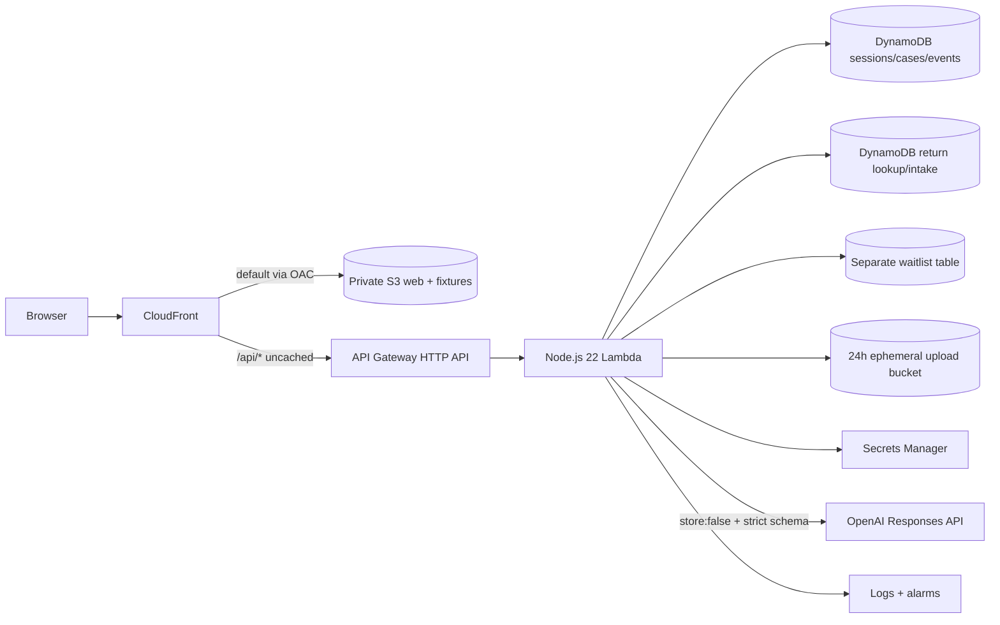

# Redo Return Integrity

An evidence-led return decision prototype that gives good shoppers a path through uncertainty, gives merchants an accountable review, and gives warehouse operators a reproducible way to capture physical ground truth.

This is an independent Senior Software Engineer candidate proposal by Canyon Smith—not an official Redo product or roadmap. The fictional merchant is **Juniper Circuit**. Commerce, payment, carrier, identity, WMS, and Reclaim data are synthetic. AWS persistence and OpenAI assessment are live only when the deployed UI says so.

[Open the live AWS prototype](https://d1s8s6dxodk0qc.cloudfront.net) · [View the public source repository](https://github.com/grandcanyonsmith/redo-return-integrity)

## The first problem

The first deep fraud/abuse family is:

- empty return;
- decoy or wrong item;
- quantity mismatch;
- possible imitation requiring qualified review;
- inconclusive evidence requiring more information.

OpenAI may extract and compare evidence, surface contradictions and exculpatory facts, abstain, and recommend a bounded next step. It cannot make a final denial, determine criminal intent, declare a person fraudulent, submit a payment dispute, or declare an item counterfeit from a photograph.

## What the prototype demonstrates

### Three end-to-end journeys

1. **Good actor at checkout:** targeted bot/payment/verified-channel/identity-vendor simulation with accessible alternatives. Completion can clear the order; decline, abandonment, and technical failure remain separate and never become fraud labels.
2. **Impossible reverse logistics:** deterministic distance/time and scan-order checks, followed by a synthetic staffed receipt, carrier trace, or human review. New evidence supersedes rather than deletes the prior decision.
3. **Managed physical return:** calibrated weight, exterior/opening/content images, quantity/SKU/serial comparisons, structured OpenAI image assessment, merchant policy, human decision, shopper contest, and evidence-ready Reclaim boundary.

### AI-assisted Scan Return

The `/intake` workstation extends Redo's publicly documented Scan Return and grading pattern with a four-step, merchant-facing workflow:

1. capture or scan a return label, complete a checksum-verified `RETURN_LABEL` S3 upload, extract only routing identifiers, and resolve an exact label/RMA/order/tracking alias in a dedicated DynamoDB lookup table; image confidence below `0.75` or identifiers that resolve to different records select no record and require manual confirmation;
2. show the matched synthetic shopper, order, SKU, quantity, explicit requested refund/currency, eligible catalog value, and immutable merchant-policy ID/version/snapshot hash before opening the parcel;
3. capture the contents and produce strict structured observations for `MATCH`, `EMPTY_BOX`, `DAMAGED_PRODUCT`, `QUANTITY_MISMATCH`, `WRONG_PRODUCT`, `POSSIBLE_IMITATION`, or `INCONCLUSIVE`;
4. present expected-versus-observed evidence, deterministic refund math, and a neutral email/SMS draft with both images labeled by provenance; then persist an evidence-complete human review before the server will accept a delivery-disabled test-outbox event.

Six package fixtures plus a synthetic label fixture make every branch reproducible without exposing a real shopper or shipping label. The original SKU comparison uses a separate fictional catalog image. The [evidence manifest](apps/web/public/evidence/manifest.json) records the label, catalog reference, match, empty-box, quantity-mismatch, wrong-item, damaged-product, and possible-imitation assets with their roles and available checksums. The browser's camera path uses a 60-second presigned S3 POST whose form policy binds the purpose, exact declared byte length, MIME type, and SHA-256 checksum; completion verifies the immutable S3 version before a purpose-bound evidence ID can reach an MCP tool. A label tool accepts only completed `RETURN_LABEL` evidence, while package analysis accepts only completed `PACKAGE_CONTENTS` evidence; inline image data is not an accepted evidence source. Fresh exact-version preview/model URLs last five minutes and are never stored as evidence. Intake lookup, analysis, drafting, review, and test queueing run through the official SDK-backed stateless Streamable HTTP endpoint at `/api/mcp`; the parallel REST routes remain available for typed integrations. Queueing writes only to a delivery-disabled test outbox, and the prototype never sends a message.

### The shared decision contract

Every one of the 15 lifecycle checkpoints exposes:

```text
native facts
  → deterministic signals
  → OpenAI assessment (structured, bounded, may abstain)
  → versioned merchant policy
  → accountable final action
  → shopper cure / appeal
  → next state
```

Evidence is filtered by `availableAt` and lifecycle position, so later warehouse outcomes cannot leak into an earlier checkout evaluation. Model, prompt, schema, policy, protocol, provenance, and simulated/live state remain visible.

## Fifteen checkpoints

| Purchase | Fulfillment | Return | Resolution |
|---|---|---|---|
| Visit & session | Outbound pack | Return request | Warehouse receipt |
| Identity link | Outbound custody | Return authorization | Item inspection |
| Checkout & payment | Delivery & possession | Reverse handoff | Refund settlement |
| Order release |  | Reverse transit | Contest, appeal & recovery |

The [lifecycle matrix](docs/lifecycle-decision-matrix.md) lists the data sources and data points available at each checkpoint, decision options, escalation triggers, and every shopper cure path.

## Product layers

| Layer | Role |
|---|---|
| Evidence & Observe (free/bundled) | standardize facts/photos/weights, draft explanations, build evidence-ready packets, run shadow evaluations, save review labor |
| Predict & Decide (Pro) | calibrated recommendations, merchant policy, proportionate challenges, experiments, and broad-surface analytics |
| Managed Verify | Redo-operated receipt/inspection protocol and highest-quality physical evidence |
| Protection (separate) | contractual risk transfer and payout accounting—not model prevention |

Evidence & Observe is the wedge: it can create operational value and better labels before predictive efficacy has been proven.

## Measurement that does not manufacture savings

The evaluation lab separates:

- verified policy-ineligible value stopped;
- randomized intention-to-treat estimated loss avoided;
- unresolved exposure/amount held;
- actual recovered cash;
- protection payout/risk transfer;
- labor savings;
- legitimate shopper friction and margin loss.

A non-verifier is not counted as fraudulent. The same dollars cannot be counted at every lifecycle stage or added across prevention, recovery, and protection.

The `$80M` managed-warehouse and `$200M` broader-surface values are supplied planning scenarios, not verified Redo revenue. They remain separate until Redo finance defines their grain, period, and relationship. Even if both are comparable merchant GMV and `$80M` is a true subset, that ratio is only physical-protocol surface coverage—not a fraud or prevention rate. See the [measurement method and worked examples](docs/measurement-methodology.md).

## Architecture



- TypeScript strict-mode domain package shared by React and Lambda.
- React 19 + Vite + React Router + TanStack Query.
- Zod runtime contracts and decision invariants.
- Deterministic rules execute before model assessment.
- GPT-5.6 Terra is the proposed default; the key is fetched server-side from a secret named `OPENAI_API_KEY`.
- CloudFront OAC keeps the web bucket private; `/api/*` is same-origin and uncached.
- Anonymous fixture sessions expire after 24 hours; opted-in waitlist records use a separate table with a 30-day active-retention target. AWS TTL deletion and retained backups may lag per policy.
- Public model budgets: 30 evaluations/session and 250/day.
- API/model/schema failure routes to human review, never denial.
- The return-intake table resolves exact label/RMA/order/tracking aliases without table scans and stores session-scoped inspections, drafts, reviews, completed-evidence metadata, and test-outbox records. Its seeded aliases and profiles are globally keyed synthetic demo data—not tenant-isolated merchant records.

The intake upload path is a two-step contract. Presign limits the declared media to JPEG/PNG/WebP up to 5 MiB and marks the object `UPLOAD_URL_ISSUED_NOT_EVIDENCE`. S3 receives a random purpose-scoped key and a one-way session binding, never the raw bearer-like session ID. Completion requires the `x-amz-version-id` returned by S3, reads that exact version, and verifies purpose/session binding, declared and actual size, content type, image magic bytes, S3 checksum, and recomputed SHA-256 before issuing a session-scoped evidence ID. Consuming tools enforce the completed evidence's exact purpose. DynamoDB stores the object key plus immutable version, not an expiring read URL; authorized responses mint a fresh five-minute version-scoped read URL when needed. The upload authorization itself lasts only 60 seconds. The older case-scoped upload route remains a scaffold and is not interchangeable with this intake completion route. Curated synthetic fixtures remain the safest public demonstration path.

Read the [architecture](docs/architecture.md), [data dictionary](docs/data-dictionary.md), [API contract](docs/api.md), and [security/privacy model](docs/security-privacy.md) for details.

## Repository layout

```text
apps/web/        React experience for landing, lifecycle, shopper, merchant,
                 operator, evaluation lab, and reset
packages/domain/ checkpoints, evidence filters, deterministic rules, policy,
                 metrics, schemas, and synthetic fixtures
services/api/    Lambda router, DynamoDB/memory stores, OpenAI Responses API,
                 Secrets Manager, verified intake uploads, official MCP SDK tools,
                 and a delivery-disabled test outbox
infra/           TypeScript CDK, CloudFormation synth, web publisher, alarms
docs/            product, lifecycle, math, architecture, deployment, and handoff
.github/         verification CI only; no automatic deployment or cloud secret
```

## Run locally

Requirements: Node.js 22 and npm 10+.

```bash
npm ci
npm run dev
```

The local Vite experience works with visible synthetic/fallback decisions when no API is served. It never silently claims that fallback is a live model result.

## Verify

```bash
npm run typecheck
npm test
npm run build
npm run synth
npm run test:e2e
```

Or run the contract/build/synth bundle:

```bash
npm run verify
```

Tests cover point-in-time evidence leakage, decision invariants, noncompletion-not-fraud, deterministic logistics/physical signals, metric double-count prevention, OpenAI schema/evidence-reference/error behavior, session/store limits, React rendering, and responsive browser journeys. GitHub Actions runs install, typecheck, unit tests, build, CloudFormation synth, and Playwright; it intentionally has no AWS deploy job.

## Deploy to AWS

The stack is pinned to `us-west-2`. It expects an existing Secrets Manager secret named `OPENAI_API_KEY`; the value never enters source, browser code, Lambda environment variables, or CloudFormation parameters.

```bash
npm run verify
npm run diff --workspace @return-integrity/infra
npm run deploy --workspace @return-integrity/infra
CONFIRM_SYNTHETIC_SEED=RedoReturnIntegrity-demo npm run seed:demo --workspace @return-integrity/infra
cd infra && npm run publish:web
```

Review the exact account, region, IAM diff, retained data resources, and scoped `s3 sync --delete` target before deployment. Full bootstrap, secret-safe setup, smoke test, rollback, and teardown instructions are in the [AWS deployment guide](docs/deployment.md).

## API summary

```text
GET  /api/health
POST /api/sessions
GET  /api/session
POST /api/session/reset
GET  /api/cases
GET  /api/cases/{caseId}
POST /api/cases/{caseId}/checkpoints/{checkpointId}/evaluate
POST /api/cases/{caseId}/actions
POST /api/cases/{caseId}/uploads
GET  /api/cases/{caseId}/evidence/{evidenceId}
POST /api/uploads/presign
POST /api/uploads/complete
POST /api/intake/label-lookup
POST /api/intake/inspections
POST /api/intake/communications/draft
POST /api/intake/reviews
POST /api/intake/communications/queue
POST /api/mcp
GET  /api/metrics
POST /api/waitlist
```

`EVIDENCE_READY`, persisted operator review, test-outbox `QUEUED_TEST_OUTBOX`, integration `QUEUED`, `SUBMITTED`, `ACKNOWLEDGED`, and processor outcome are distinct. Package inspections and communication drafts carry model-call audit metadata; each draft carries a SHA-256 of its send-relevant content. A review display label is explicitly unauthenticated and must record `draftDecision:"APPROVE_AS_WRITTEN"` against that exact draft hash, inspection, return, and evidence set. Queueing recomputes and compares the hash before accepting a delivery-disabled outbox record. This prototype sends no email/SMS, executes no refund, and submits no dispute. `/api/mcp` is implemented with the official `@modelcontextprotocol/server` v2 SDK as a stateless Streamable HTTP endpoint for protocol `2026-07-28`; the Lambda adapter returns terminal JSON for current-protocol calls and deliberately disables MCP sessions, resumability, subscriptions, and mid-call notifications.

## Documentation

The [documentation index](docs/README.md) routes every review question. Core deliverables:

- [Product specification](docs/product-spec.md)
- [15-checkpoint lifecycle matrix](docs/lifecycle-decision-matrix.md)
- [Measurement methodology](docs/measurement-methodology.md)
- [Production implementation plan and time to revenue](docs/implementation-plan.md)
- [Brand/design extrapolation](docs/brand-design-guide.md)
- [Redo portal research and product-fit notes](docs/redo-portal-research.md)
- [Source register](docs/sources.md)
- [~8-minute Loom storyboard](docs/loom-storyboard.md)
- [Demo runbook](docs/demo-runbook.md)
- [Notion publication guide](docs/notion-publishing-guide.md)
- [Four-link release checklist](docs/delivery-checklist.md)

## Four-link release

The release checklist prevents a private, stale, or broken owner-view link from being delivered. Final URLs are added only after signed-out verification:

| Deliverable | Status |
|---|---|
| Live AWS prototype | [deployed and signed-out verified](https://d1s8s6dxodk0qc.cloudfront.net) |
| Public GitHub source | [repository URL](https://github.com/grandcanyonsmith/redo-return-integrity) |
| Published Notion specification | pending verified read-only URL |
| 5–10 minute Loom | pending verified public video URL |

## Important limitations

- It is a demonstration with a fictional merchant and synthetic fixture cases.
- Only AWS and OpenAI are designed as live paths; Redo/Shopify/payment/carrier/identity/WMS/Reclaim are typed simulators.
- A live OpenAI result requires the deployed secret and model access; otherwise the correct behavior is safe review/fallback.
- At the documented 2026-08-24 release snapshot, the [release checklist](docs/delivery-checklist.md) records OpenAI provider billing as blocked. Until model access is reverified, camera-image assessments must be described as `SAFE_FALLBACK`, not successful live-model results.
- Intake upload completion verifies transport and file integrity, but it is not malware scanning, qualified product authentication, or production chain of custody. The case-scoped presign route remains nonfinalized.
- A presigned upload form remains reusable by its bearer for its 60-second validity window, although its key, exact byte length, MIME type, checksum, metadata, and purpose are fixed. Issuance is limited to 12 policies per session and 120 per UTC day in the demo. Production still needs single-use issuance state, authenticated tenant byte budgets, WAF/anomaly controls, and storage-cost alarms.
- Anonymous sessions are not production authentication/RBAC. The seeded return aliases and profiles are globally keyed and intentionally synthetic; a production deployment must add Redo SSO/OAuth, tenant-prefixed lookup keys, server-side tenant binding, and role checks across lookup, inspection, review, drafting, and queueing before using merchant data.
- Market sources are context, not merchant-specific base rates.
- No prevented-fraud claim, pricing forecast, or `$80M`/`$200M` accounting definition has been validated by Redo.
- The visual system is an explicitly labeled extrapolation from Redo's public presence, not an official brand kit.

## License

[MIT](LICENSE). Redo may use or commercialize the original code under that license. Redo trademarks and third-party services/content remain subject to their respective rights and terms.
