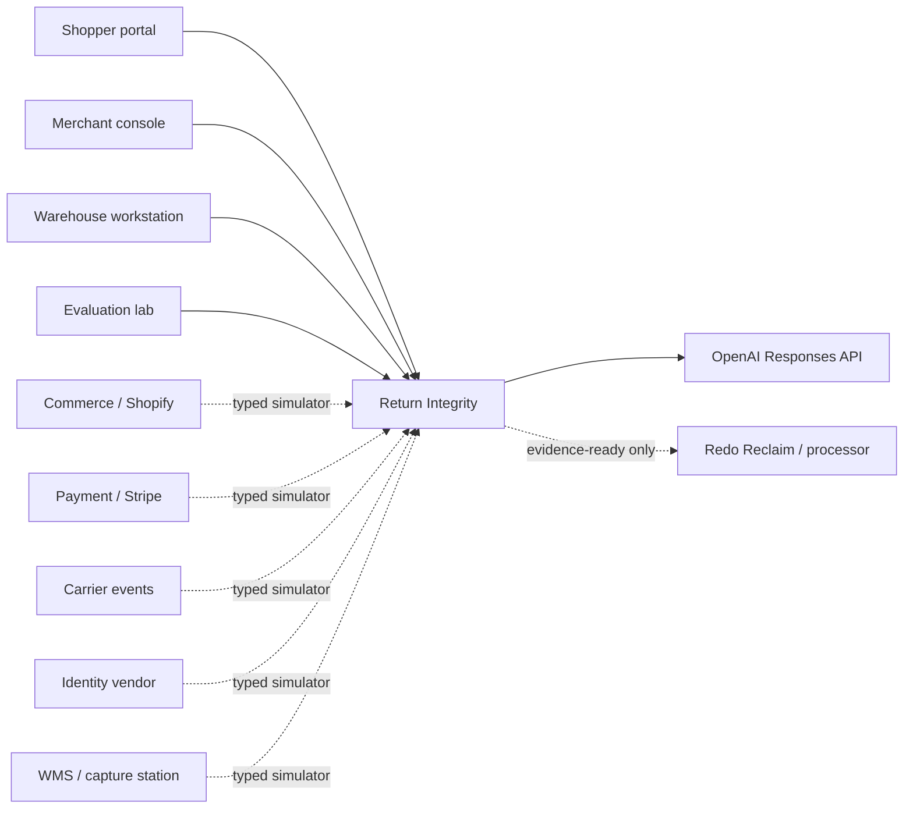
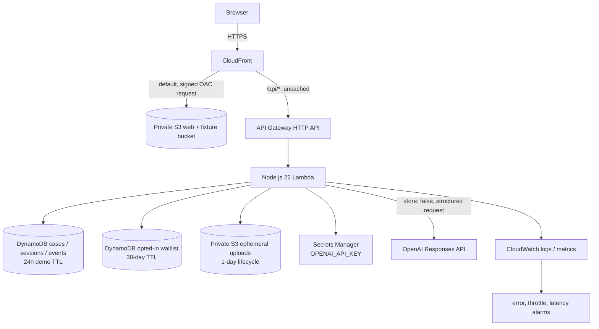
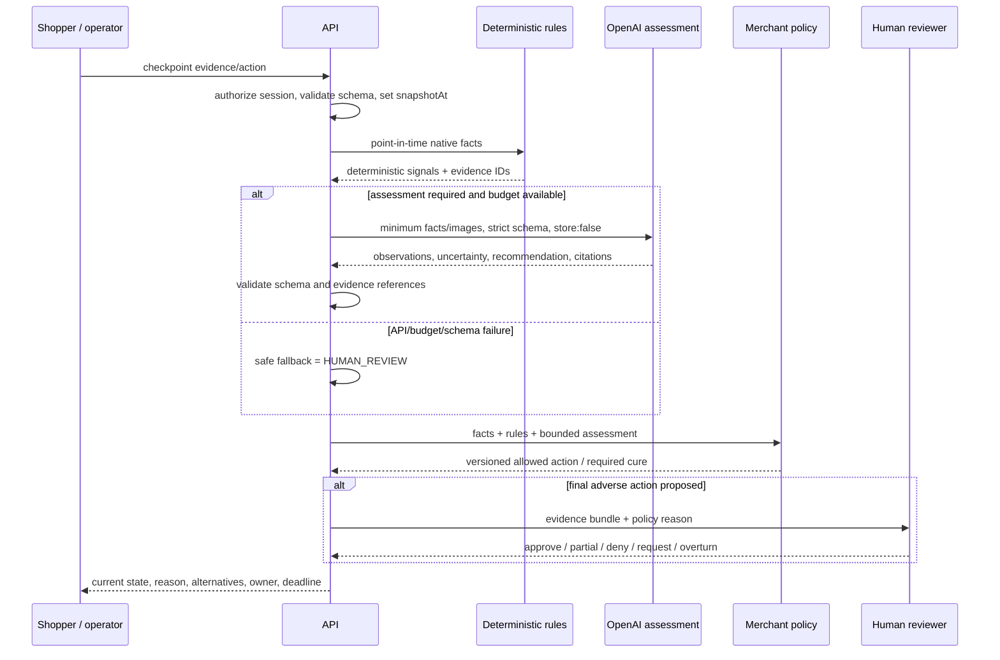
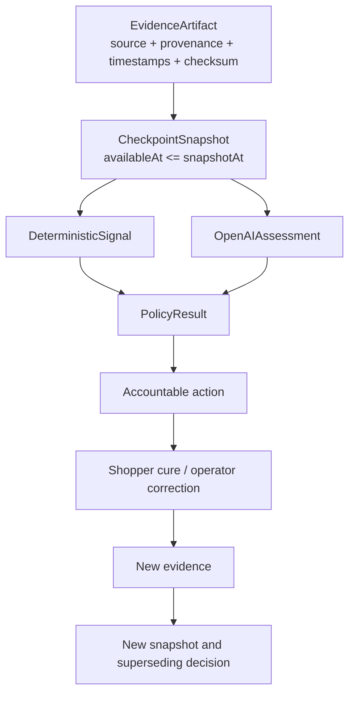
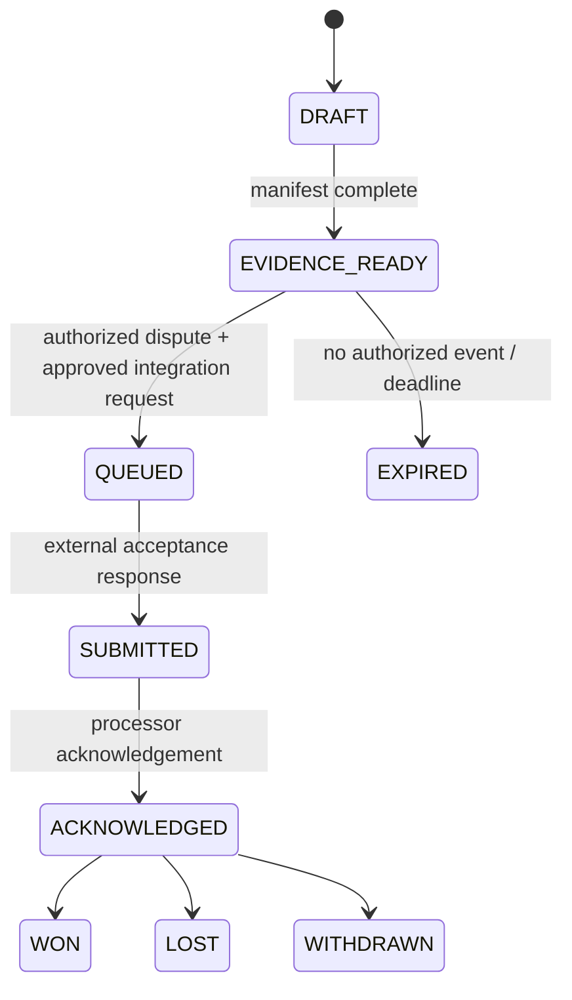

# Architecture

Redo Return Integrity is a single-origin React and AWS serverless application with versioned domain contracts. The public prototype uses synthetic Redo/Shopify/payment/carrier/identity/Reclaim adapters; the OpenAI assessment and AWS persistence paths are real when the `OPENAI_API_KEY` secret exists.

## Context

Dashed lines are intentionally simulated in the interview prototype. They are adapter seams, not claims of live partner integration.

## AWS deployment

Key boundaries:

- CloudFront Origin Access Control is the only public read path to static S3 content.
- API traffic uses the same public origin at `/api/*`; CloudFront caching is disabled for API responses.
- Optional evidence uploads never share a bucket with the public web build.
- Waitlist records never share a table or API read path with anonymous demo cases.
- The OpenAI key is resolved inside Lambda from Secrets Manager. CloudFormation sees only the secret name and IAM reference.

## Decision pipeline

The model is advisory. Deterministic signals remain visible. Merchant policy restricts available actions. Only `HumanDecision` can finalize `DENY`.

## Fifteen-checkpoint state flow

```mermaid
flowchart LR
  C1[1 Visit] --> C2[2 Identity]
  C2 --> C3[3 Checkout]
  C3 --> C4[4 Order release]
  C4 --> C5[5 Outbound pack]
  C5 --> C6[6 Outbound custody]
  C6 --> C7[7 Delivery]
  C7 --> C8[8 Return request]
  C8 --> C9[9 Authorization]
  C9 --> C10[10 Reverse handoff]
  C10 --> C11[11 Reverse transit]
  C11 --> C12[12 Warehouse receipt]
  C12 --> C13[13 Inspection]
  C13 --> C14[14 Settlement]
  C14 --> C15[15 Appeal / recovery]
```

The flow is not strictly linear in storage. Events are append-only; corrections and appeals create superseding records. A case projection derives the current state.

## Evidence and decision composition

Facts are not copied into a mutable “truth” field. The system retains provenance and reconstructs what was knowable.

## Reclaim/evidence state machine

The UI must never render `EVIDENCE_READY` as “submitted.” A generated email or packet is not sent by the public prototype.

## Runtime responsibilities

### React client

- renders shopper, merchant, operator, lifecycle, and evaluation personas;
- holds no secret and makes no direct OpenAI request;
- validates user input before API submission;
- re-encodes optional images to strip metadata where browser support allows;
- displays provenance, model/policy versions, simulated/live badges, and state owner;
- provides session reset and responsive keyboard-accessible flows.

### Lambda API

- creates cryptographically random anonymous sessions;
- applies per-session and daily evaluation budgets;
- validates request schemas and declared upload type/size/checksum format; the prototype presign route marks the object “not evidence” until a future finalize-time magic-byte/checksum check exists;
- persists append-only events and current projections;
- executes deterministic rules before model calls;
- fetches the OpenAI key only when assessment is required;
- validates strict model output and evidence references;
- creates short-lived signed upload/read URLs for the scaffold; demonstrated model evidence comes from curated fixtures;
- hashes normalized waitlist email for dedupe and stores only consented fields;
- emits structured, redacted operational logs.

### DynamoDB

The main single table stores session, case projection, event, evidence metadata, checkpoint decision, action, and counter records. `PK`/`SK` support case-local timelines. The waitlist table partitions only by `emailHash` for true dedupe.

TTL is a cleanup mechanism, not authorization. The API checks `expiresAt` before returning a record because DynamoDB deletion is asynchronous.

### S3

- web/fixtures: private, versioned, SSE-S3, CloudFront OAC, retained on stack deletion;
- uploads: private, SSE-S3, presigned access, one-day lifecycle, retained bucket shell on stack deletion.

S3 Lifecycle expiration is asynchronous. API authorization and evidence URL expiry enforce the 24-hour product boundary even if physical deletion completes later.

## Adapter path to production

Each simulator implements the same typed inbound event shape a live adapter would produce:

1. authenticate webhook/API source;
2. preserve native provider ID and occurred/received time;
3. map provider fields without losing the raw reference;
4. classify privacy/use scope;
5. ensure idempotency;
6. append evidence;
7. trigger eligible checkpoint evaluation;
8. report integration status separately from business decision status.

Production adapters require vendor contracts, webhook signing, retries/dead-letter handling, tenant authorization, backfill/reconciliation, and provider-specific rate-limit management.

## Failure behavior

| Failure | Safe behavior |
|---|---|
| OpenAI unavailable/timeout | deterministic result remains; assessment status `UNAVAILABLE`; route to review when assessment was required |
| invalid model schema/reference | discard assessment, log metric without evidence content, review |
| carrier/identity simulator or future vendor outage | record `TECHNICAL_FAILURE`; alternate path or review; never fraud |
| evidence missing/expired | request specific replacement or review; never invent fact |
| API quota exceeded | return explicit `429`, preserve state, no adverse transition |
| Dynamo write conflict | idempotency key/retry; no duplicate decision or settlement |
| upload invalid/oversize | reject before model call; explain allowed types/limit; presigned objects remain non-evidence without finalization |
| CloudFront static error | SPA fallback for GET; API errors are not rewritten/cached |

## Infrastructure tradeoffs

- **DynamoDB over relational storage:** fits event/projection access patterns and deploy simplicity before the exact production schema is known. A warehouse/analytics export would be added for longitudinal analysis rather than scanning the operational table.
- **Lambda over long-running service:** economical and simple for an interview/pilot workload; later sustained image workloads may justify queues/workers.
- **CloudFront single origin:** avoids browser CORS complexity and protects the S3 origin. Direct API access remains possible unless an origin-verification control/WAF is added for production.
- **Retained data resources:** avoids irreversible deletion on stack teardown. A documented, separately approved cleanup is required.

## Production additions before merchant data

- Redo tenant authentication/authorization and staff RBAC;
- per-merchant KMS and retention requirements where needed;
- AWS WAF/bot/rate rules and origin verification;
- async queue/DLQ for model and evidence jobs;
- audit-log export and security alert routing;
- private networking/egress policy assessment;
- data warehouse export with governed identity/label joins;
- disaster recovery, backup restore tests, SLOs, and on-call runbooks;
- vendor DPIA/legal review and merchant/customer notices.
- upload finalization with server-side magic-byte/checksum verification before any object becomes evidence.
