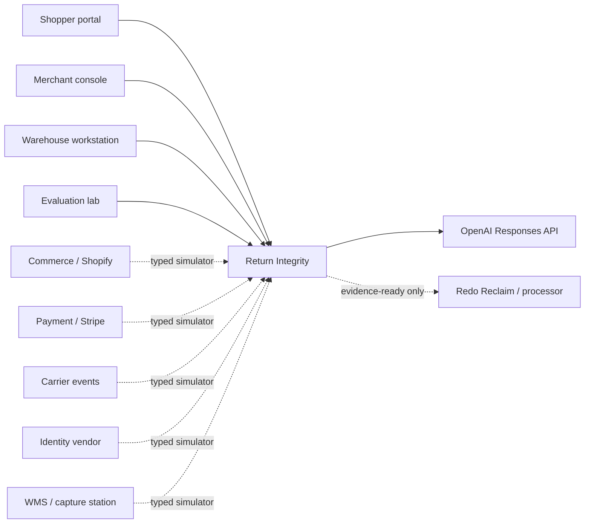
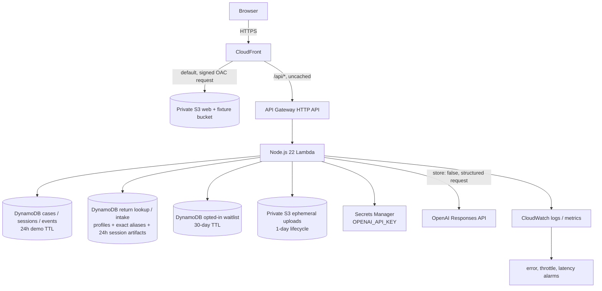
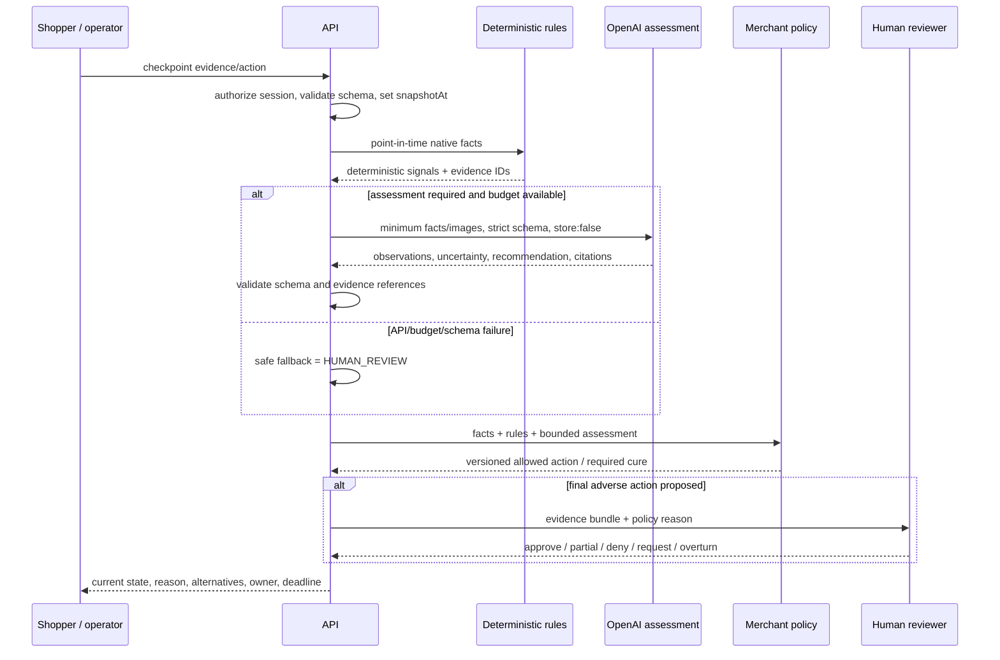
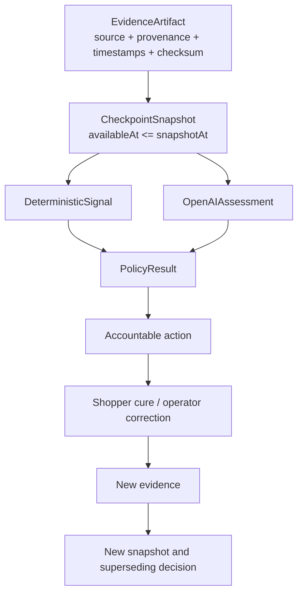
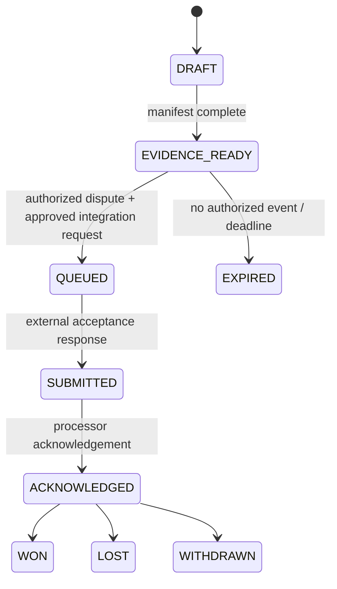

# Architecture

Redo Return Integrity is a single-origin React and AWS serverless application with versioned domain contracts. The public prototype uses synthetic Redo/Shopify/payment/carrier/identity/Reclaim adapters; AWS persistence is real in the deployment, and the OpenAI call path is real only when the secret exists and the provider accepts the requested model. Provider, billing, timeout, and schema failures remain safe fallbacks rather than live-result claims.

## Context



Dashed lines are intentionally simulated in the interview prototype. They are adapter seams, not claims of live partner integration.

## AWS deployment



Key boundaries:

- CloudFront Origin Access Control is the only public read path to static S3 content.
- API traffic uses the same public origin at `/api/*`; CloudFront caching is disabled for API responses.
- Optional evidence uploads never share a bucket with the public web build.
- Waitlist records never share a table or API read path with anonymous demo cases.
- Durable synthetic return profiles and label/RMA/order/tracking aliases live in a dedicated lookup table. Those demo profile/alias keys are global, not tenant-scoped; only the downstream intake evidence, inspections, drafts, reviews, and test-outbox records are session-scoped and expire after 24 hours. This boundary is safe only for the fictional seed and is a production blocker for merchant data.
- The OpenAI key is resolved inside Lambda from Secrets Manager. CloudFormation sees only the secret name and IAM reference.

## Decision pipeline



The model is advisory. Deterministic signals remain visible. Merchant policy restricts available actions. Only `HumanDecision` can finalize `DENY`.

## Merchant return-intake pipeline

```mermaid
sequenceDiagram
  participant O as Warehouse operator
  participant UI as Scan Return UI
  participant S3 as Ephemeral S3
  participant API as Lambda intake service
  participant DB as Return lookup table
  participant OAI as OpenAI Responses API
  participant H as Accountable reviewer

  O->>UI: capture label or enter scanner value
  opt camera image
    UI->>API: presign(purpose, type, size, SHA-256)
    API-->>UI: 60-second POST + signed form fields; not evidence
    UI->>S3: multipart POST exact image bytes
    S3-->>UI: x-amz-version-id
    UI->>API: complete(object key, version ID, purpose, SHA-256)
    API->>S3: HEAD + GET exact version
    API->>API: verify exact declared purpose, opaque session binding, version, size, MIME signature, S3 + recomputed SHA-256
    API->>DB: store session-scoped completed-evidence metadata
  end
  UI->>API: MCP tools/call lookup_return_by_label(image evidence or direct identifier)
  opt image extraction
    API->>API: require completed RETURN_LABEL evidence; no inline image
    API->>OAI: untrusted label image + strict routing schema, store:false
    OAI-->>API: nullable identifiers + confidence + evidence IDs
  end
  API->>DB: exact LABEL/RMA/ORDER/TRACKING alias read
  API->>API: require confidence >= 0.75; reject cross-record identifier conflict
  DB-->>API: matched synthetic return + requested amount/currency + policy ID/version/hash + catalog SKU/quantity/value/image
  API-->>UI: expected return record and provenance, or no selection/manual confirmation
  O->>UI: capture opened package and record native operator facts
  UI->>API: MCP tools/call analyze_return_contents(return ID, evidence)
  API->>API: require completed PACKAGE_CONTENTS evidence; no inline image
  API->>OAI: catalog reference + warehouse image + strict finding schema
  OAI-->>API: observations/classification/uncertainty only
  API->>API: validate references/invariants; downgrade low confidence; cap money at min(requested, eligible)
  API->>DB: persist inspection + modelAudit under session
  API-->>UI: expected vs observed + next step + human-review gate
  UI->>API: MCP tools/call draft_return_communication
  API-->>UI: DRAFT_NOT_SENT + catalog/warehouse manifest + modelAudit + contentSha256
  H->>UI: review facts, amount, wording, draft, and evidence provenance
  UI->>API: record_return_review(APPROVE_AS_WRITTEN, exact evidence set)
  API->>DB: bind review to exact draft hash/context + unauthenticated display label
  UI->>API: MCP tools/call queue_test_communication(draft ID, review ID)
  API->>API: recompute draft hash; verify same session/draft/inspection/return/evidence/review
  API->>DB: idempotent QUEUED_TEST_OUTBOX + draft hash, deliveryDisabled=true
```

The label extractor cannot authorize a return: its nullable identifiers are only candidates for exact database lookup. Image confidence below `0.75` and identifiers that resolve to different records both fail closed without selecting a profile. The package model cannot calculate money or execute an action. `MATCH` and quantity-based amounts derive from catalog cents and are capped at the lower of the explicit requested refund and eligible total; empty/wrong/possible-imitation cases produce temporary holds under the same cap; damaged/inconclusive cases produce no amount. The persisted return request carries currency and an immutable policy ID/version/snapshot hash rather than treating catalog eligibility or a schema version as merchant policy. Every result requires human approval. Native operator facts such as `Missing`, `Process`, `Undeclared item`, and `Quarantine` stay visibly separate from model-generated observations.

Eight privacy-safe intake assets support the reproducible path: one synthetic return label, one fictional catalog reference, and package views for match, empty box, quantity mismatch, wrong item, damaged product, and possible imitation. They are static release assets, not real warehouse evidence. For a camera capture, the browser re-encodes the bounded image, calculates SHA-256, and submits a 60-second presigned multipart form whose policy fixes the purpose, exact declared byte length, MIME type, checksum, and metadata. The client captures S3's exposed version ID; completion verifies and downloads that exact version before passing only the resulting session-scoped, purpose-bound evidence ID to the MCP tool. Label and package tools require `RETURN_LABEL` and `PACKAGE_CONTENTS`, respectively, and the contract exposes no inline image input. A fresh read/model URL is scoped to that exact version for 300 seconds and is never stored.

## Fifteen-checkpoint state flow


The flow is not strictly linear in storage. Events are append-only; corrections and appeals create superseding records. A case projection derives the current state.

## Evidence and decision composition



Facts are not copied into a mutable “truth” field. The system retains provenance and reconstructs what was knowable.

## Reclaim/evidence state machine



The UI must never render `EVIDENCE_READY` as “submitted.” A generated email or packet is not sent by the public prototype.

## Runtime responsibilities

### React client

- renders shopper, merchant, operator, lifecycle, and evaluation personas;
- renders the four-step `/intake` Scan Return workstation with immediate camera/fixture preview, expected-versus-observed evidence, raw structured output, and an accountable review gate;
- holds no secret and makes no direct OpenAI request;
- validates user input before API submission;
- re-encodes optional images to strip metadata where browser support allows, computes SHA-256, completes the S3 evidence protocol, and invokes intake operations through current-protocol stateless MCP tool calls;
- displays provenance, requested/refundable amount and currency, policy ID/version/snapshot hash, model-call audit metadata, simulated/live badges, and state owner;
- provides session reset and responsive keyboard-accessible flows.

### Lambda API

- creates cryptographically random anonymous sessions;
- applies per-session and daily evaluation budgets;
- validates request schemas and declared upload type/size/checksum format; intake presign marks the object “not evidence,” emits a random purpose-scoped key plus one-way session binding, and signs a 60-second exact-length POST policy; intake completion requires an immutable S3 version and verifies purpose/session binding, S3 metadata/checksum, actual size, content type, image magic bytes, and recomputed SHA-256 before issuing an evidence ID; consuming tools then require the exact evidence purpose and never accept inline image data as provenance;
- persists append-only events and current projections;
- executes deterministic rules before model calls;
- fetches the OpenAI key only when assessment is required;
- validates strict model output, cross-field invariants, and exact evidence references; label confidence below `0.75` and cross-record alias conflicts select no return record;
- stores model audit metadata for package inspections and communication drafts, hashes send-relevant draft content, and requires the exact hash plus `APPROVE_AS_WRITTEN` review binding before queueing;
- creates 60-second presigned upload forms and fresh 300-second exact-version read URLs; expiring read URLs are never stored in inspection/draft records; the case-scoped presign remains a scaffold, while the dedicated intake completion route can promote a valid object version to session-scoped completed-evidence metadata;
- resolves return labels through exact DynamoDB aliases; verifies the synthetic one-line USD request, policy ID/version, and canonical policy-snapshot hash; and stores session-scoped package inspections, communication drafts, operator reviews, completed-evidence metadata, and delivery-disabled outbox messages;
- exposes the intake operations as native REST routes and through the official MCP TypeScript SDK's stateless Streamable HTTP handler; each request receives a fresh server/transport, tool failures use `CallToolResult.isError`, and the Lambda boundary buffers one terminal JSON result while disabling sessions, subscriptions, resumability, and mid-call notifications;
- hashes normalized waitlist email for dedupe and stores only consented fields;
- emits structured, redacted operational logs.

### DynamoDB

The main single table stores session, case projection, event, evidence metadata, checkpoint decision, action, and counter records. `PK`/`SK` support case-local timelines. The waitlist table partitions only by `emailHash` for true dedupe.

The dedicated return-lookup table uses `PK`/`SK` for two different, intentionally bounded access patterns:

- durable synthetic profiles at `RETURN#{returnRecordId}` / `PROFILE`;
- direct pointers at `LOOKUP#{LABEL|RMA|ORDER|TRACKING}#{normalizedValue}` / `POINTER`;
- 24-hour session artifacts at `SESSION#{sessionId}` with `EVIDENCE#`, `INSPECTION#`, `DRAFT#`, `REVIEW#`, or `OUTBOX#DRAFT#` sort-key prefixes.

The seed script writes five fictional `example.test` profiles and twenty exact aliases in one bounded, idempotent batch. It neither scans nor deletes the table. Lookup consumes model-extracted identifiers only as keys; a model result cannot create a return record. The profile and alias keys are deliberately global synthetic demo fixtures, so any anonymous demo session that knows one can resolve it. Production must add tenant-prefixed keys, Redo SSO/OAuth, RBAC, and server-side tenant binding across lookup, inspection, evidence, review, drafting, and queueing before any real profile is loaded.

TTL is a cleanup mechanism, not authorization. The API checks `expiresAt` before returning a record because DynamoDB deletion is asynchronous.

### S3

- web/fixtures: private, versioned, SSE-S3, CloudFront OAC, retained on stack deletion;
- uploads: private, versioned, SSE-S3, presigned POST access, exact-size/checksum policy conditions, `x-amz-version-id` exposed to the browser, one-day current/noncurrent-version lifecycle, retained bucket shell on stack deletion.

S3 keys are random and purpose-scoped (`ephemeral/intake-return-label/{uuid}` or `ephemeral/intake-package-contents/{uuid}`); metadata carries a domain-separated one-way session binding instead of the raw bearer-like session ID. Intake completion uses `HEAD` and `GET` with the client-supplied version ID, then downloads the bounded object once to validate image signatures and SHA-256. Durable evidence metadata stores the key, immutable version, and exact purpose, while every displayed/model-consumed URL is minted fresh for that exact version for five minutes. A successful completion establishes the file-integrity and session-binding prerequisites for this demo, not malware safety, product authenticity, or litigation-grade custody. Static generated fixtures remain in the private web/fixture bucket and are delivered only through CloudFront.

S3 Lifecycle expiration is asynchronous. API authorization and evidence URL expiry enforce the 24-hour product boundary even if physical deletion completes later.

The 60-second presigned form is still a replayable bearer capability. A replay is constrained to the same random key, exact declared bytes, MIME type, checksum, purpose, and metadata and produces a distinct version. The demo atomically limits issuance to 12 policies per session and 120 per UTC day, but does not persist single-use issuance state or apply authenticated tenant byte budgets. Storage alarms, WAF/anomaly controls, and single-use issuance remain production gates.

## Adapter path to production

Each simulator implements the same typed inbound event shape a live adapter would produce:

1. authenticate webhook/API source;
2. preserve native provider ID and occurred/received time;
3. map provider fields without losing the raw reference;
4. classify privacy/use scope;
5. ensure idempotency;
6. append evidence;
7. trigger eligible checkpoint evaluation;
8. report integration status separately from business decision status.

Production adapters require vendor contracts, webhook signing, retries/dead-letter handling, tenant authorization, backfill/reconciliation, and provider-specific rate-limit management.

## Failure behavior

| Failure | Safe behavior |
|---|---|
| OpenAI unavailable/timeout | deterministic result remains; assessment status `UNAVAILABLE`; route to review when assessment was required |
| invalid model schema/reference | discard assessment, log metric without evidence content, review |
| carrier/identity simulator or future vendor outage | record `TECHNICAL_FAILURE`; alternate path or review; never fraud |
| evidence missing/expired | request specific replacement or review; never invent fact |
| wrong evidence purpose | reject with `403 EVIDENCE_PURPOSE_MISMATCH`; do not call the model |
| label confidence below `0.75` or aliases conflict across records | select no return record; warn and require manual confirmation |
| API quota exceeded | return explicit `429`, preserve state, no adverse transition |
| Dynamo write conflict | idempotency key/retry; no duplicate decision or settlement |
| upload invalid/oversize/mismatched | reject before model call; no evidence ID; explain allowed type/limit; preserve safe fixture option |
| provider billing/model entitlement unavailable | return `SAFE_FALLBACK`; preserve deterministic facts; no adverse transition or live-model claim |
| CloudFront static error | SPA fallback for GET; API errors are not rewritten/cached |

## Infrastructure tradeoffs

- **DynamoDB over relational storage:** fits event/projection access patterns and deploy simplicity before the exact production schema is known. A warehouse/analytics export would be added for longitudinal analysis rather than scanning the operational table.
- **Exact alias records over table scans:** a label model only extracts routing candidates; fixed label/RMA/order/tracking keys resolve to a return profile deterministically and make lookup latency/cost auditable.
- **Lambda over long-running service:** economical and simple for an interview/pilot workload; later sustained image workloads may justify queues/workers.
- **CloudFront single origin:** avoids browser CORS complexity and protects the S3 origin. Direct API access remains possible unless an origin-verification control/WAF is added for production.
- **Retained data resources:** avoids irreversible deletion on stack teardown. A documented, separately approved cleanup is required.

## Production additions before merchant data

- Redo tenant authentication/authorization and staff RBAC, plus tenant-prefixed return/alias keys and downstream tenant binding;
- per-merchant KMS and retention requirements where needed;
- AWS WAF/bot/rate rules and origin verification;
- async queue/DLQ for model and evidence jobs;
- audit-log export and security alert routing;
- private networking/egress policy assessment;
- data warehouse export with governed identity/label joins;
- disaster recovery, backup restore tests, SLOs, and on-call runbooks;
- vendor DPIA/legal review and merchant/customer notices;
- upload quarantine, malware/polyglot scanning, content-disarm policy where appropriate, and enforceable metadata removal before merchant images enter production workflows;
- OAuth/resource-server authentication, Redo tenant RBAC, official-client interoperability coverage, and an independent MCP conformance/security review before external production exposure;
- production delivery adapters only after sender authentication, template governance, approval/audit controls, opt-out handling, and explicit authorization.
